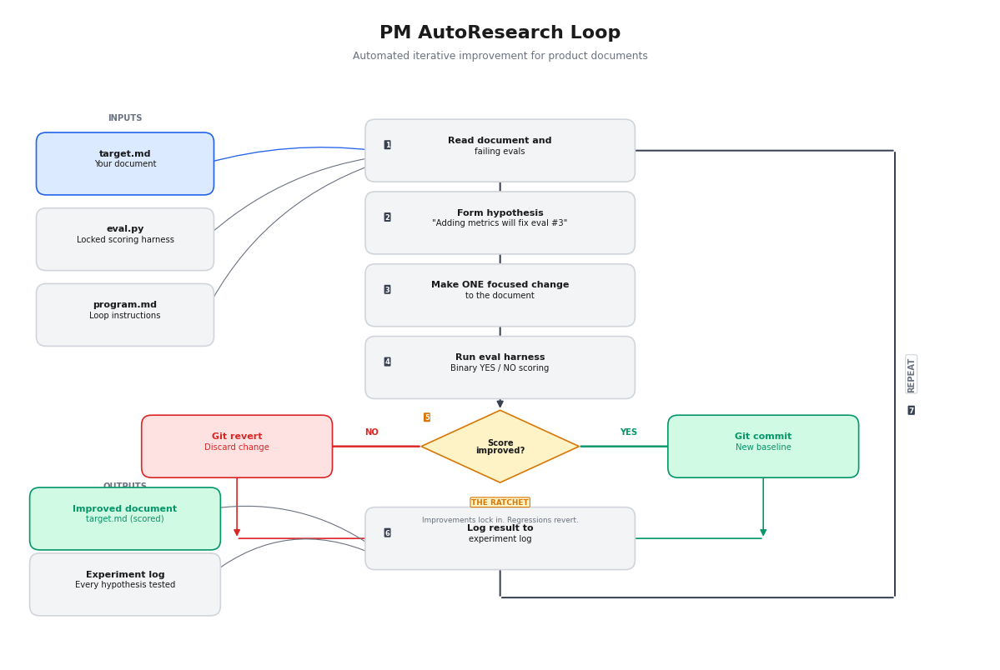

# PM AutoResearch

<div align="center">


</div>

Your product spec has problems your feedback round will not catch.

Feedback rounds are social. People flag what they notice, shaped by their role and their relationship with you. Wording improves. Scope questions come up. But the structural assumptions baked into the foundation of the doc almost never get challenged. Those are the ones that break the project three months in.

PM AutoResearch replaces subjective feedback rounds with a scored, automated improvement loop. You define what "good" means with binary yes/no questions. The agent provides a baseline set of questions based on document context. An agent iterates on your document 30+ times, keeping only changes that improve the score. Everything else reverts. The result: a measurably better document plus a log of every hypothesis the agent tested and what worked.

**Real result:** A PRD went from 17% to 94% in 4 rounds against 18 binary criteria covering problem definition, success metrics, acceptance criteria, scope boundaries, and risk mitigation.

<div align="center">

</div>

## The Problem

Most product documents improve through feedback rounds where the same doc gets different comments from different people on different days. No score. No baseline. No way to know if the doc is improving or just changing.

Common failure modes:
- **Vague success metrics.** "Improve user experience" instead of a number someone can measure in 30 days.
- **Missing acceptance criteria.** Stories that describe intent but nothing an engineer could write a test against.
- **Handwaved dependencies.** "We will work with the platform team" with no owner, no timeline, no fallback.
- **Risks without mitigation.** "We will monitor" is not a plan.
- **Scope creep baked in.** No explicit list of what the feature will NOT do.

These are not opinion problems. They are structural problems with binary answers: either the doc has a quantified success metric or it does not. Either every dependency has an owner or it does not.

That is what makes them scorable.

## How It Works

You point it at a document. The agent reads your doc, generates a tailored set of binary evals based on the document type and content, and starts iterating. You do not need to write evals from scratch. The agent proposes a starting set, you review and adjust, and the loop begins.

The system uses three files:

| File | What it is | Who controls it |
|------|-----------|----------------|
| **target.md** | The document to improve (PRD, strategy, one-pager, system prompt) | Agent edits this |
| **eval.py** | Binary scoring harness (yes/no questions) | Locked. Agent cannot touch |
| **program.md** | Loop instructions and constraints | You define once |

The agent runs in a loop:

1. Reads the document and identifies which evals are failing
2. Forms a hypothesis: "Adding quantified success metrics will pass eval #3"
3. Makes ONE focused change
4. Runs the scoring harness
5. **Score improved?** Git commit. New baseline. **Score same or worse?** Git revert. Change never happened.
6. Logs the result and repeats

One change per round. If two things change and the score goes up, you cannot attribute the improvement. Single changes make the experiment log interpretable.

The key insight: **the experiment log is more valuable than the final document.** It shows you every hypothesis tested, what worked, what did not, and why. That is an artifact no feedback round produces.

## Quick Start

### Prerequisites

- An LLM CLI ([Claude Code](https://docs.anthropic.com/en/docs/claude-code) recommended, or set `LLM_COMMAND` for alternatives)
- Python 3.10+
- Git

### Install

```bash
git clone https://github.com/vednikolic/pm-autoresearch.git
cd pm-autoresearch
```

### Option A: With Claude Code (recommended)

Claude Code discovers the skill automatically.

```
/pm-autoresearch path/to/your-document.md
```

The agent reads your document, analyzes its structure and content, and suggests a tailored eval suite. You review the evals, adjust any that do not fit, and the loop begins. No blank page.

### Option B: With Any LLM

Copy `.claude/skills/pm-autoresearch/SKILL.md` and use it as instructions for your LLM agent. The pattern works with any model that can read/write files and use git.

| Tool | Install |
|------|---------|
| ChatGPT | Paste `SKILL.md` into Custom GPT instructions or project instructions |
| Cursor | Copy to `.cursor/rules/pm-autoresearch.md` |
| Windsurf | Copy to `.windsurfrules` |
| Cline / Roo | Add `SKILL.md` path to custom instructions |
| Gemini CLI | Copy to `.gemini/instructions/pm-autoresearch.md` |

### Option C: Fully Automated (run overnight)

```bash
LLM_COMMAND="claude -p --model sonnet" python3 scripts/run_loop.py \
  --target target.md \
  --scoring eval.py \
  --program program.md \
  --max-rounds 30
```

## Step by Step (Manual Setup)

### 1. Define your evals

When using the skill, the agent reads your document and proposes evals specific to its content. A PRD about a recommendation engine gets evals about metric specificity and integration boundaries. A strategy doc about market expansion gets evals about competitive evidence and resource allocation. You start with a foundation, not a blank page.

If you prefer to write evals by hand or customize the generated set, use `evals.json` with yes/no questions that test specific qualities:

```json
[
  {
    "id": "has_problem_statement_with_impact",
    "category": "structure",
    "check": "Does the document contain a problem statement that quantifies who is affected and what it costs?",
    "weight": 1.5
  },
  {
    "id": "success_metrics_measurable_in_30_days",
    "category": "specificity",
    "check": "Does the document define at least 3 success metrics that can be measured within 30 days of launch with specific numeric targets?",
    "weight": 1.5
  },
  {
    "id": "every_dependency_has_owner",
    "category": "completeness",
    "check": "Does every external dependency name a specific owner and include a timeline or fallback if delayed?",
    "weight": 1.0
  },
  {
    "id": "scope_says_what_it_will_not_do",
    "category": "structure",
    "check": "Does the document explicitly list what the feature will NOT do or what is out of scope?",
    "weight": 1.0
  },
  {
    "id": "no_vague_timelines",
    "category": "specificity",
    "check": "Are all timelines expressed as specific dates or sprint numbers, with no instances of 'soon', 'later', or 'when ready'?",
    "weight": 1.0
  }
]
```

**Good evals** are binary (yes or no), specific (quote what to look for), and testable by any reviewer. **Bad evals** are subjective ("Is this compelling?"), undefined ("Does it cover everything?"), or compound ("Is it clear AND complete?").

A battle-tested PRD eval suite (18 evals, the one that produced 17% to 94%) is included at `templates/prd_evals_template.json`.

### 2. Generate the scoring harness

```bash
python3 scripts/generate_eval.py --evals evals.json --output eval.py
```

### 3. Write loop instructions

Copy `templates/program_template.md` to `program.md` and fill in:
- **Research direction hints:** what areas the agent should explore first
- **Constraints:** what the agent must not change (structure, tone, specific sections)

### 4. Initialize and run

```bash
git init && git add target.md eval.py program.md && git commit -m "baseline"
git checkout -b autoresearch/run-1

python3 eval.py target.md --verbose 2>&1 | tee baseline.log

echo -e "round\tscore\tpassing\ttotal\thypothesis\tchange_description\tkept" > results.tsv

# Interactive
claude "Read program.md and begin the autoresearch loop on target.md"

# Or automated
python3 scripts/run_loop.py --target target.md --scoring eval.py --program program.md --max-rounds 30
```

### 5. Review

```bash
python3 scripts/analyze_results.py results.tsv
git diff main..autoresearch/run-1 -- target.md
```

## Scoring Model

Each eval has a weight. Critical evals (problem statement, success metrics) get 1.5. Standard evals get 1.0. Nice-to-haves get 0.5.

```
composite_score = (sum of weights for passing evals) / (sum of all weights) * 100
```

The keep/revert threshold is **strictly greater than**. Equal scores revert because LLM judges have variance. A lateral move might actually be a regression.

## Adapting for Different Documents

The skill includes eval templates and direction hints for:

| Document type | What the evals test |
|---------------|-------------------|
| **PRDs** | Problem-solution fit, metric specificity, acceptance criteria, scope boundaries, dependency ownership |
| **Strategy docs** | Current state diagnosis, vision coherence, resource allocation, risk identification, timeline milestones |
| **System prompts** | Instruction clarity, output format spec, edge case handling, constraint completeness |
| **One-pagers** | Executive summary quality, decision framing, action item ownership |

See `references/eval-design.md` for a deep guide on writing evals for each type.

## What You Get

After a run you have:

1. **The improved document.** Every change that improved the score, committed to git. Every change that did not, reverted. No lateral moves.
2. **The experiment log** (`results.tsv`). Every round: hypothesis, change description, score delta, kept or reverted. This is the artifact that shows your spec got better through evidence, not opinion.
3. **The git history.** Full diff of what changed and in what order. Rollback to any round.

## Project Structure

```
pm-autoresearch/
├── .claude/skills/pm-autoresearch/
│   └── SKILL.md              # Skill definition (auto-discovered by Claude Code)
├── scripts/
│   ├── generate_eval.py      # Create eval.py from evals.json
│   ├── run_loop.py           # Automated loop runner (run overnight)
│   └── analyze_results.py    # Post-run analysis
├── templates/
│   ├── eval_template.py      # Eval harness boilerplate
│   ├── evals_template.json   # Example eval suite (generic)
│   ├── prd_evals_template.json  # Battle-tested PRD evals (17% → 94%)
│   └── program_template.md   # Agent loop instruction template
├── references/
│   └── eval-design.md        # Deep guide: writing good binary evals
├── assets/
│   └── loop-diagram.png      # Visual of the improvement loop
└── meta-run/                 # Example: the skill improving itself (15% → 95%)
```

## Eval Inversion: When Your Evals Are the Problem

Most eval suites hit 100% too fast. When a PRD passes every check on the first run, the score feels good but tells you nothing. The evals were testing "does section X exist?" instead of "is section X specific enough to actually work?" A perfect score with shallow evals is worse than a 60% score with hard ones, because it gives false confidence.

**Eval inversion** flips the loop: freeze the document, iterate the evals instead.

### How It Works

Say you wrote 18 evals for a stakeholder analysis skill. The document scores 100% on the first baseline. That means every eval is a presence check that any reasonable document passes. Here is what you do:

**1. Freeze the document.** Do not touch `target.md`.

**2. Audit each eval against four criteria:**

| Criterion | Question | Action if it fails |
|-----------|----------|-------------------|
| Discriminability | Would a mediocre version of this document also pass? | Replace with a harder version |
| Behavioral consistency | Would two different LLMs produce the same result from this instruction? | Add specificity requirements |
| Contradiction coverage | Do any pairs of instructions in the document conflict? | Write cross-reference evals |
| Edge case coverage | What inputs would break the workflow? | Write evals for those inputs |

**3. Replace shallow evals with hardened versions.**

Before (structural floor, always passes):
```json
{
  "id": "has_confidence_scoring",
  "check": "Does the document define a confidence scoring system?"
}
```

After (tests whether confidence scoring actually resists gaming):
```json
{
  "id": "confidence_discriminates_quality",
  "check": "Does the confidence scoring system explicitly handle the case where many low-signal artifacts (e.g., 6 meeting notes where the stakeholder only said 'looks good') should NOT produce High confidence?",
  "weight": 1.5
}
```

Before (presence check):
```json
{
  "id": "has_update_command",
  "check": "Does the document define an /update-profile command?"
}
```

After (tests a real failure mode):
```json
{
  "id": "update_handles_conflicting_evidence",
  "check": "Does the /update-profile command specify how to handle new artifacts that CONTRADICT existing profile themes? For example, if a stakeholder historically pushes back on timeline but a new artifact shows them approving an aggressive timeline.",
  "weight": 1.5
}
```

**4. Run the hardened suite.** The score should drop to 30-60%. If it stays above 80%, the new evals are still too shallow.

**5. Unfreeze the document.** Resume the normal autoresearch loop with the hardened evals.

### Real Example

The [stakeholder-radar](https://github.com/vednikolic/stakeholder-radar) skill went through this exact process:

| Phase | Eval count | Baseline | What changed |
|-------|-----------|----------|-------------|
| v1 evals (structural) | 18 | 100% | Every eval was a presence check |
| v2 evals (hardened) | 20 | 31.82% | Tests behavioral consistency, contradiction handling, edge cases, feature interactions |

The v1 suite told us the document had all the right sections. The v2 suite told us the sections had gaps: no guidance for conflicting evidence, no interaction between staleness and confidence, no handling of multi-stakeholder artifacts. Those are the problems that break the skill in real use.

### When to Trigger Eval Inversion

- Baseline score above 85% on first run
- Score reaches 100% before round 10
- 5+ evals pass in every round without ever failing

### Eval Quality Tiers

When writing hardened evals, aim for this distribution:

| Tier | What it tests | Target share |
|------|-------------|-------------|
| Structural floor | Does the section exist? | 30% max |
| Precision | Is the instruction specific enough to follow mechanically? | 20% |
| Behavioral | Would two LLMs produce the same output? | 15% |
| Contradiction | Do instructions conflict with each other? | 15% |
| Edge case | What happens with unusual inputs? | 10% |
| Interaction | Do features that should affect each other actually connect? | 10% |

## Meta-Run: The Skill Improving Itself

The `meta-run/` directory contains a complete example where PM AutoResearch improved its own skill definition. Starting from 15%, the loop brought it to 95% across 20 binary evals covering instructional clarity, completeness, eval framework quality, self-containment, and adaptation to different document types.

## Background

This is an adaptation of [Karpathy's autoresearch pattern](https://x.com/karpathy/status/1886192184808149383) for product documents. The original pattern optimizes ML training scripts against validation loss. This version optimizes any text document against a binary eval suite. The core mechanism is the same: a locked scoring function, an agent that proposes changes, and git as the ratchet that ensures the document only moves in one direction.

## Author

Ved Nikolic ([vednikolic.com](https://vednikolic.com))

## License

MIT
